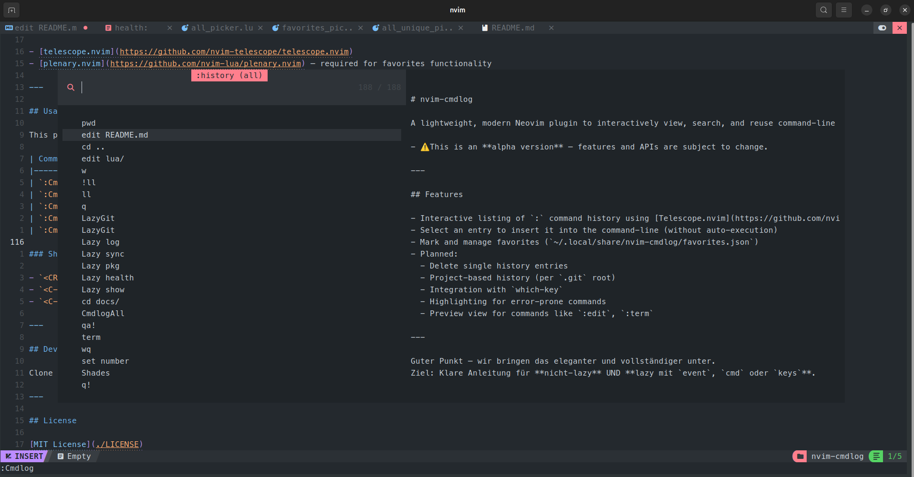
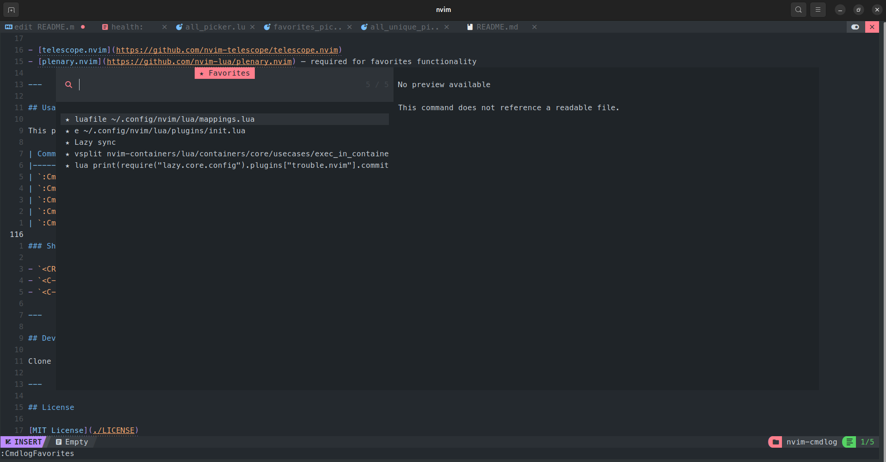

# nvim-cmdlog

A lightweight, modern Neovim plugin to interactively view, search, and reuse command-line mode (`:`) history using Telescope.

---

## Features



- Interactive listing of `:` command history using [Telescope.nvim](https://github.com/nvim-telescope/telescope.nvim)
- Picker backend selectable: Telescope.nvim or fzf-lua
- Select an entry to insert it into the command-line (without auto-execution)
- Mark and manage favorites (`~/.local/share/nvim-cmdlog/favorites.json`)
- Planned:
  - Delete single history entries
  - Project-based history (per `.git` root)
  - Integration with `which-key`
  - Highlighting for error-prone commands
  - Preview view for commands like `:edit`, `:term`



---

## Installation (with Lazy.nvim)

You can install `nvim-cmdlog` like this:

### Load immediately (recommended for most setups)

This ensures all commands (:Cmdlog, :CmdlogFavorites, etc.) are available without delay.

```lua
{
  "StefanBartl/nvim-cmdlog",
  lazy = false,
  dependencies = {
    "nvim-lua/plenary.nvim",
    "nvim-telescope/telescope.nvim", -- Required if you use picker = "telescope"
    "ibhagwan/fzf-lua",              -- Required if you use picker = "fzf"
  },
  config = function()
    require("cmdlog").setup({
      picker = "telescope",  -- or "fzf"
    })
  end,
}
```

### Load lazily (alternative)

You can also lazy-load the plugin if you prefer:

#### Option 1: Lazy-load on demand (command)

```lua
{
  "StefanBartl/nvim-cmdlog",
  lazy = true,
  cmd = {
    "CmdlogNvimFull", "CmdlogNvim", "CmdlogFull", "Cmdlog",  -- see Note!
    "CmdlogShellFull", "CmdlogShell", "CmdlogFavorites"
  },
  dependencies = {
    "nvim-lua/plenary.nvim",
    "nvim-telescope/telescope.nvim",
    "ibhagwan/fzf-lua",
  },
  config = function()
    require("cmdlog").setup({
      picker = "fzf", -- or "telescope"
    })
  end,
}
```

> **Note**: Only the commands listed here will be available for lazy-loading. Make sure to include the ones you intend to use, such as `Cmdlog`, `CmdlogFavorites`, etc. If a command is omitted, it won't work when lazy-loaded.

#### Option 2: Lazy-load via keybindings

```lua
{
  "StefanBartl/nvim-cmdlog",
  lazy = true,
  keys = {
    { "<leader>cl", "<cmd>Cmdlog<CR>", desc = "Show command history" },
    { "<leader>cf", "<cmd>CmdlogFavorites<CR>", desc = "Show favorites" },
  },
  dependencies = {
    "nvim-lua/plenary.nvim",
    "nvim-telescope/telescope.nvim",
    "ibhagwan/fzf-lua",
  },
  config = function()
    require("cmdlog").setup({
      picker = "telescope",
    })
  end,
}
```

---

#### Option 3: Lazy-load on specific event

```lua
{
  "StefanBartl/nvim-cmdlog",
  lazy = true,
  event = "VeryLazy", -- or e.g. "BufReadPost"
  dependencies = {
    "nvim-lua/plenary.nvim",
    "nvim-telescope/telescope.nvim",
  },
  config = function()
    require("cmdlog").setup({
      picker = "telescope",  -- or "fzf"
  })
}
```

Note: If you lazy-load the plugin, make sure to define how it should be triggered (`cmd`, `keys`, `event`, etc.), otherwise commands like `:Cmdlog` won’t be available.

---

## Dependencies

Make sure the following plugins are installed:

- [telescope.nvim](https://github.com/nvim-telescope/telescope.nvim)
- [plenary.nvim](https://github.com/nvim-lua/plenary.nvim) – required for favorites functionality
- [fzf-lua](https://github.com/ibhagwan/fzf-lua) (only if picker = "fzf")

---

## Picker configuration (Telescope vs FzfLua)

By default, `nvim-cmdlog` uses **Telescope** for all pickers and UI interactions.
However, you can switch to [fzf-lua](https://github.com/ibhagwan/fzf-lua) by setting:

```lua
require("cmdlog").setup({
  picker = "fzf",
})
```

| Picker | Notes |
|:---|:---|
| `telescope` (default) | Full feature support, including command previews (e.g., file contents for `:edit somefile.txt`) |
| `fzf` | Minimal, fast UI. **Currently no preview support** for commands like `:edit`. (Planned for future versions.) |

### When to use which picker?

- **Telescope**: Recommended if you want previews, fuzzy sorting, and a richer UI experience.
- **FzfLua**: Recommended if you prefer speed, simplicity, and minimal dependencies.

| Feature                       | Telescope             | FzfLua            |
|:-------------------------------|:----------------------|:------------------|
| Fuzzy Search                  | ✅ Built-in            | ✅ Built-in        |
| Command Previews (`:edit`)     | ✅ Available           | ❌ Not available yet |
| Favorite toggling (`<C-f>`)    | ✅ Available           | ✅ Available       |
| Performance (Speed)            | ⚡ Good                | ⚡⚡ Very fast      |
| UI Customization (Prompt, Border) | ✅ Highly customizable | ✅ Highly customizable |
| External Dependencies          | Telescope + Plenary   | Only Plenary       |

---

## Usage

This plugin provides several Telescope-based pickers to explore and reuse command-line history.

### Plugin Demo


### Command Syntax

`{Cmdlog}{Util}[optional Full]`

### Commands

| Command              | Description                                                            |
|----------------------|------------------------------------------------------------------------|
| `:CmdlogFavorites`    | Shows commands you've marked as favorites                              |
| `:Cmdlog`             | Combines favorites and history, showing only unique commands (no duplicates) |
| `:CmdlogFull`         | Combines favorites and full history, allowing duplicates               |
| `:CmdlogNvim`         | Shows only unique Neovim (`:`) commands (latest occurrence kept)      |
| `:CmdlogNvimFull`     | Shows full Neovim (`:`) history, including duplicates                 |
| `:CmdlogShell`        | Shows unique shell history (latest occurrence kept)                   |
| `:CmdlogShellFull`    | Shows full shell history, including duplicates                         |

---

### Shortcuts (inside pickers)

- `<CR>`: Insert command into `:` (does not execute)
- `<Tab>`: Toggle favorite
- `<C-r>`: Refresh picker

---

## Development

To develop or contribute:

1. Clone the repo:

```bash
git clone https://github.com/StefanBartl/nvim-cmdlog ~/.config/nvim/lua/plugins/nvim-cmdlog
```

2. Symlink or load manually via your plugin manager.
3. Make changes, test with :Cmdlog, submit PRs or open issues.

**Contributions are welcome** – whether it's a bugfix, feature, or idea!

---

## License

[MIT License](./LICENSE)

---

## Disclaimer

ℹ️ This plugin is under active development – some features are planned or experimental.
Expect changes in upcoming releases.

---

## Feedback

Your feedback is very welcome!

Please use the [GitHub issue tracker](https://github.com/StefanBartl/nvim-cmdlog/issues) to:
- Report bugs
- Suggest new features
- Ask questions about usage
- Share thoughts on UI or functionality

For general discussion, feel free to open a [GitHub Discussion](https://github.com/StefanBartl/nvim-cmdlog/discussions).

If you find this plugin helpful, consider giving it a ⭐ on GitHub — it helps others discover the project.

---
