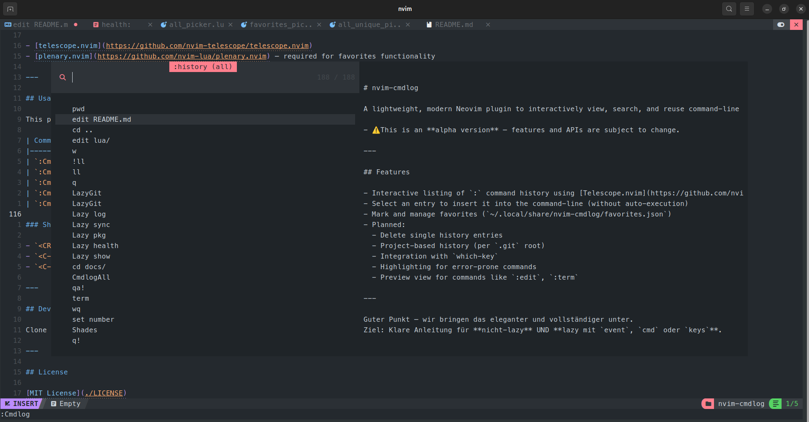

> **Beta stage — active development.** This repository is past its first shape and in
> active use, but the surface is not frozen: breaking changes are still possible. Pin a
> commit or tag if you depend on it.

# cmdlog.nvim

```
 ██████╗███╗   ███╗██████╗ ██╗      ██████╗  ██████╗
██╔════╝████╗ ████║██╔══██╗██║     ██╔═══██╗██╔════╝
██║     ██╔████╔██║██║  ██║██║     ██║   ██║██║  ███╗
██║     ██║╚██╔╝██║██║  ██║██║     ██║   ██║██║   ██║
╚██████╗██║ ╚═╝ ██║██████╔╝███████╗╚██████╔╝╚██████╔╝
 ╚═════╝╚═╝     ╚═╝╚═════╝ ╚══════╝ ╚═════╝  ╚═════╝
                                            .nvim
```

[](LICENSE)
[](https://neovim.io)
[](https://www.lua.org)


Interactively view, search and reuse your Neovim command-line (`:`) history and
your shell history, through Telescope or fzf-lua. Commands are inserted into
the command-line, never executed for you — this is recall, not automation.



---

## Documentation

Start at [docs/README.md](docs/README.md) — what's where, and which question
each page answers.

**The Basics**

- [Requirements](docs/installation.md#requirements) — Neovim version, required plugins and one picker backend.
- [Installation](docs/installation.md) — every package manager, and what lazy-loading costs.
- [Quickstart](docs/quickstart.md) — the first thing to run after installing.

**Configuration**

- [All options](docs/configuration.md) — every `setup()` option, its default, and where it is read.
- [Commands](docs/commands.md) — each `:Cmdlog` subcommand and its arguments.
- [Bindings](docs/BINDINGS.md) — every user command, in-picker keymap and autocmd.

**The Rest**

- [What you get with the defaults](docs/what-you-get.md) — the 5–8 things that matter on day one.
- [Features](docs/FEATURES/README.md) — one page per part of the plugin, and why each has its shape.
- [Workflow](docs/WORKFLOW.md) — how the subcommands, favorites, tags and scoping combine into a habit.
- [Around it](docs/around-it.md) — how this plugin's scope differs from its siblings in the collection.
- [Integrations](docs/integrations.md) — which third-party plugins cmdlog notices when installed.
- [Health check](docs/FEATURES/PICKER.md#checkhealth-cmdlog) — what `:checkhealth cmdlog` reports.
- [Adding a picker backend](docs/add_picker.md) — what a third front end would have to implement.
- [Contributing](docs/CONTRIBUTING.md) — ground rules and project layout.
- [Feedback](https://github.com/StefanBartl/cmdlog.nvim/issues)

`:help cmdlog` is the same reference inside the editor.

---

## License

MIT — see [LICENSE](LICENSE).
