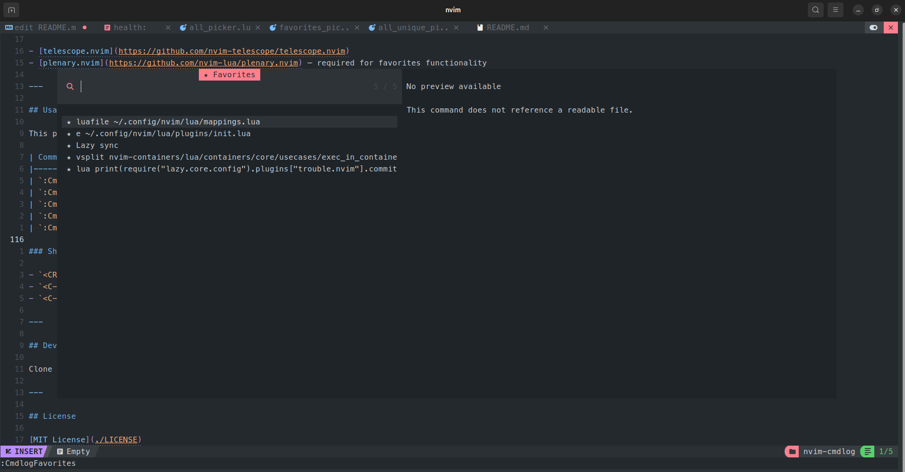

# What you get with the defaults

Your `:` history and your shell history are two separate, half-usable stores:
one is capped and dies with the session, the other lives in a file your editor
cannot see. cmdlog reads both, puts them in one picker, and then adds the parts
neither has — favorites that persist, per-project scoping, usage counts, and a
warning before you re-run something that ended badly last time.

- **Neovim and shell history in one list** — `zsh`, `bash`, `fish`, `nu`, `ksh`,
  `csh` and PowerShell history files are detected per shell; entries in the
  combined pickers are labelled by origin and separated by divider rows.
- **Favorites and tags, persisted** — `<Tab>` marks, `<C-t>` tags, `<C-z>` undoes,
  `<C-Up>`/`<C-Down>` reorder; `:Cmdlog export`/`import` moves the list between
  machines.
- **Project-scoped history and favorites** — history recorded inside the current
  Git root, and optionally a separate favorites file per project.
- **Usage stats** — commands sorted by how often you actually ran them, annotated
  with the last use.
- **Risky-command highlighting** — `rm -rf`, `git reset --hard`, `:qa!` and
  friends stand out before you reuse them; the pattern list is yours to tune, and
  `:Cmdlog risky test <cmd>` says which pattern fired.
- **Known-error markers** — a command whose last run set an error message is
  flagged with `✗`.
- **Privacy filter** — commands matching `password`, `token`, `Bearer`, … are
  never written to cmdlog's own plaintext stores.
- **Previews** — `:edit` shows the file; `:help`, `:lua`, `:!` and `:term` show
  what *would* run, and only actually run it if you opt in with
  `preview_execute = true`.
- **Deleting entries** — `<C-x>` removes a command from its real source, be that
  Neovim's `:` history or the shell history file.
- **Your own history files** — `extra_files` folds arbitrary plain-text command
  lists in as read-only sources.
- **Configurable keys, which-key aware** — every in-picker key is remappable or
  disableable, and optional normal-mode entry points carry a `desc`.

Expect bugs, especially around shell history on Windows.

One page per feature, with the reasoning behind each, in
[FEATURES/README.md](FEATURES/README.md). Every command in this list is
detailed in [commands.md](commands.md).
